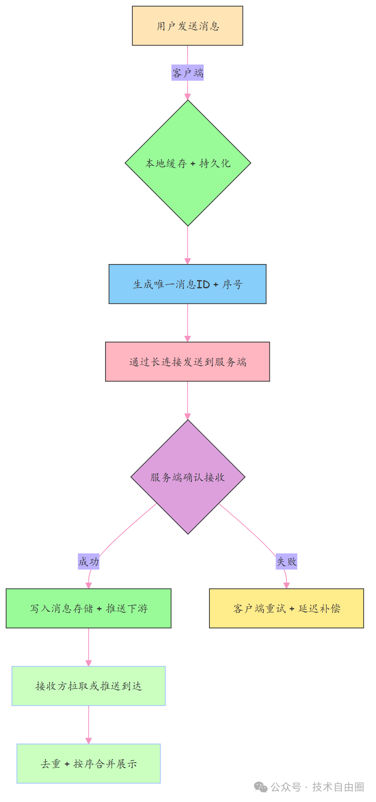
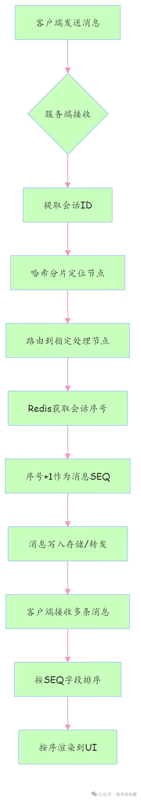
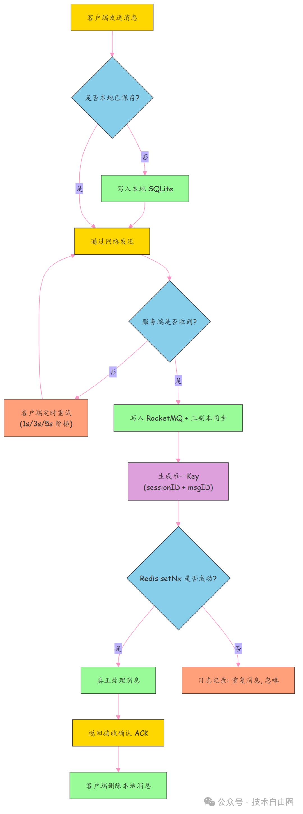

# IM架构如何保障可靠性、有序性

“IM 消息怎么做到不丢、不重、还按顺序到达？”

这个问题，涉及到 IM 系统 核心就三个“症状”：

- (1) 消息不能丢（可靠性）比如：用户点了发送，不能因为服务宕机或网络抖动，消息石沉大海。
- (2) 顺序不能乱（有序性）比如： “在吗？” 回成 “吗在？”，群聊时间线错乱，体验直接崩盘。
- (3) 弱网也能用（可用性）比如： 地铁隧道、电梯间，网络断了又连，消息不能卡住不动。

这三大痛点，才是 IM 架构的命门所在。

**IM 消息从发出到接收的关键路径**



这个流程图是讲架构时的主心骨：

- 消息发出后先落地本地数据库，防止 App 崩溃丢失；
- 然后发给服务端，等 ACK 确认；没收到？自动重试；
- 到了服务端还得持久化+广播；
- 消费者那边还要去重、排序、合并展示。”

## 第一问：如何保障消息有序：业务分区 + 消息序号

> 传统方案的瓶颈，我们怎么破？

早期做消息有序，很多人第一反应是搞个“全局发号器”——所有消息排一队，挨个编号再发。理想很丰满，现实很骨感：高并发下一拥而上抢号，发号器直接被打满；更致命的是，它一旦宕机，全链路雪崩。这就像春运火车站只开一个售票窗——再快也撑不过三分钟。所以，我们必须换思路：不搞大一统，而是分片独立发号，让每个“窗口”自给自足，互不干扰。

### 1. 痛点拆解：为什么消息会乱？

我们先还原一个真实场景，想象一下你和朋友聊天：
- 你说：“1 吃饭了吗？”
- 他回：“2 刚吃完。”
- 你又说：“3 吃啥呢？”
结果对方手机上显示成：
- “3 吃啥呢？” 
- “1 吃饭了吗？” 
- “2 刚吃完。”

这不是 bug，是分布式系统的常态。

三条消息走不同服务节点、经不同网络路径，到达时间完全不可控，最终呈现顺序错乱。

问题本质是什么？

一个要“串行等”，一个想“并发冲”，天然冲突。

这时候有人会说：那我加个全局排序服务不就行了？

可以，但代价太大——一个中心节点最多撑几万 QPS，面对百万群聊、亿级用户，还没上线就已过载。

所以，**全局有序不是解，而是枷锁**。我们要的不是“天下大同”，而是“各聊各的别乱就行”。

### 2. 解决方案：分而治之 + 局部有序

真正的突破口在于：**我们根本不需要全局有序，只需要“会话内有序”**。

你和张三的聊天记录不能乱，但你和李四的聊天跟王五的完全无关——何必放一起排序？

这就引出了经典策略：**分而治之 + 局部有序**。

具体怎么做？两步走稳：

> 第一步 业务分区：哈希分片，锁定归属

用 sessionId 做一致性哈希，确保同一个会话的所有消息始终路由到同一个处理节点。

按“会话ID”做哈希，算出该消息该由哪个节点处理。

同一会话 → 哈希值一样 → 路由到同一台机器 → 所有消息串行处理，天然避免跨节点乱序。

这样一来，单个会话内的消息在服务端就是串行处理的，天然不会乱。

> 第二步 局部序号：独立发号，局部递增

每个会话独立维护一个计数器，每来一条消息就+1，作为它的“官方序号”。

每个会话,可以配一个独立计数器（比如 Redis 的 INCR），每来一条消息就+1，生成唯一 SEQ。

客户端不管什么时候收到消息，只认这个序号，按序号从小到大排列展示。

这个 SEQ 就是这条消息的“官方身份证号”，客户端只认这个，不看接收时间。

这就像电影院检票——你可以早到晚到，但座位按票号定。

哪怕后排观众先进场，也不会坐到前排去。

### 3. 伪代码落地（核心片段）

> （1）服务端分片路由逻辑

来看关键实现：如何把消息精准投递给“对的人”。

```java
String sessionId = msg.getSessionId();
//这里是伪代码，实际代码以mq 的负载均衡机制为准
int nodeIndex = Math.abs(sessionId.hashCode()) % clusterNodeCount;
//这里写个伪代码，代表mq 主从复制
ClusterNode targetNode = clusterNodes.get(nodeIndex);
targetNode.sendMsg(msg);
```

核心就一句：**基于会话 ID 哈希取模，固定路由**。

从此，每个会话都有了自己的“专属服务通道”，不再受其他会话影响。

> （2）服务端序号分配逻辑

接下来，给每条消息发“通行证”。

```java
long msgSeq = redis.incr("msg_seq_" + sessionId);
msg.setSeq(msgSeq);
msg.setUniqueKey(sessionId + "_" + msgSeq);
```

这里用了 Redis 的 INCR，保证同一个会话下的 SEQ 绝对递增，且线程安全。

同时用sessionId_seq 作为唯一键，既能幂等去重，也能防止重试导致消息重复入库。

实战提示：如果你的 Redis 是集群模式，记得确保同一个会话的 key 落在同一 slot，否则 INCR 可能跨节点失效。

> （3）客户端排序逻辑

最后一步，客户端收尾：别急着渲染，先排好队。

```java
//这里是伪代码， 先排序
List<Msg> sortedMsgs = msgList.stream()
 .sorted(Comparator.comparingLong(Msg::getSeq))
 .collect(Collectors.toList());
//这里是伪代码， 再渲染
renderMsgList(sortedMsgs);
```

无论消息以什么顺序到达，统统按 seq 升序排列后再上屏。

哪怕第100条先到，第1条后到，也能正确归位。

这也是为什么我们强调“客户端必须信任服务端 SEQ”——它是唯一真相源。

### 4. 思想提炼：放弃全局有序，换高可用与高性能

总结一下，这套方案的核心思想就一句话：

> 不要为“假需求”买单——我们不需要全局有序，只需要业务上有意义的有序。

你看微信、钉钉、飞书，哪一个是把全平台消息排成一条队列的？

没有。

它们都选择了“会话级隔离 + 局部有序”的设计，这才是工业级系统的通用解法。

背后的分布式哲学也很清晰：

| 策略 | 目标 |
|-------|-------|
| 分片（Sharding） | 把大问题切小，降低复杂度 |
| 局部有序 | 在可控范围内保证一致性 |
| 客户端兜底 | 用“官方 SEQ”统一认知，屏蔽网络抖动 |

最终换来的是：

高并发支持（水平扩展）

高可用（无单点）

强一致体验（用户无感知）

这正是中高级开发者必须掌握的权衡思维：不是技术做不到，而是要不要做。

有时候，“不做全局有序”，反而是最正确的选择。

### 5. 有序性 架构 的核心流程图



从发起到渲染，全程围绕“会话隔离”和“局部发号”展开。

每一个环节都在为同一个目标服务：**在分布式环境下，低成本实现用户可感知的“顺序正确**”。

**加分点总结**：- 能说出“全局有序 vs 局部有序”的区别- 理解哈希分片的适用边界（如热点会话）- 知道 Redis INCR 的原子性保障机制- 明确客户端排序的必要性（不依赖接收顺序）

这套方案不仅适用于 IM，还可迁移到订单状态流转、操作日志同步、事件溯源等场景——**凡是“局部强序 + 全局高可用”的需求，都能套用**。

## 第二问： 如何保障 可靠性，不丢失

### 1. 痛点拆解：消息总丢？不是网络差，是设计没兜底！

产品做着做着，用户开始投诉：“我明明发了消息，对方怎么没收到？”

你查日志发现——消息真丢了。

但更可怕的是：你也不知道它什么时候丢的。

这背后，其实是移动场景下的经典三连击：

- 地铁进隧道，网络闪断；
- App 被系统杀掉，进程没了；
- 对方服务器刚好在发布，接口500……

你以为只是“发一下”，其实要穿越重重险境才能抵达。

结果就是：

- 消息发不出去 → 用户以为被无视；
- 或者重试太多 → 对方收到一堆重复“在吗？”；
- 最后用户体验崩了，客服工单爆了。

所以问题本质不是“快不快”，而是：

> “宁可慢点，也不能丢；就算重发，也不能重复。”

这就是我们常说的**可靠消息投递**——一个看似简单的需求，却是高可用系统的分水岭。

### 2. 解决方案：三层兜底，像保险一样层层防

光靠“发一次”肯定不行。我们要学保险公司，给关键消息上三重保险：

- 自己先复印一份存档 → 客户端本地存
- 邮局签收后锁进保险柜，并异地备份 → 服务端落盘 + 副本
- 如果没收到回执，隔段时间再寄，但对方只认一次 → 超时重试 + 幂等去重

每一层都不贵，合起来却能扛住99%的异常。

下面看每层怎么落地。

> ① 第一层：客户端兜底 —— 消息先存本地，解决网络不稳定问题

记住一句话：只要没收到 ACK，就当没发成功。

所以第一步不是联网，而是先把消息塞进手机本地数据库（比如 SQLite）：

```java
db.saveLocalMsg(msg); // 先落库，保命
boolean sendOk = network.send(msg);
if (!sendOk) {
 scheduleRetry(msg, 1000); // 发失败？排队重试
}
```

再加上客户端scheduleRetry 采用阶梯式重试策略：

- 第1次失败 → 1秒后重试
- 第2次失败 → 3秒后重试
- 第3次失败 → 5秒后重试

避免雪崩式刷屏，既保障可靠性，又不压垮服务。

只有等到服务端明确说“我收到了”，才把这条消息从本地删掉。

就像快递发货单：客户签收了，你才能撕票。

这样哪怕 App 崩溃、手机重启，下次打开照样继续发——用户体验无缝衔接。

而如果不做这一步？一旦断网或崩溃，消息直接蒸发，用户永远不知道。

> ② 第二层：服务端兜底 —— 实现 服务端持久化的高可靠

客户端发来了，服务端能不能直接处理完就返回？

**绝对不行！**

如果此时机器宕机，消息还在内存里没来得及持久化，那就真的丢了。

正确做法是两步走：

- (1) 收到消息立刻写入 RocketMQ（支持刷盘、集群同步）
- (2) 同步复制到至少3个副本节点，确保单点故障不丢数据

```java
rocketMQ.send(msg); // 必须落盘，断电也不怕
replicaService.syncTo3Replicas(msg); // 多副本容灾
response.sendAck(msg.getUniqueKey()); // 此时才能回 ACK
```

这一步的关键是：ACK 必须在落盘之后发！否则就是“虚假确认”，等于骗客户端“我收到了”，其实自己也没保住。

这一层扛住了服务端单机崩溃的风险，是整个链路的数据基石。

> ③ 第三层：幂等性设计 —— 保障exact one

前面两层解决了“存得住”的问题，但这还不够。

现实是：网络可能超时、包可能丢失、ACK 可能没传回来。

于是客户端必须重试。但重试带来新问题：

“我已经处理过了，再来一遍怎么办？”

解决办法是：**用唯一键 + 幂等控制**。

每个消息生成全局唯一的 key（如sessionID:msgID），服务端通过 Redis 的原子操作判断是否已处理：

```java
String uniqueKey = msg.getUniqueKey();
if (redis.setNx(uniqueKey, "processed", 86400)) {
 processMsg(msg); // 第一次来，正常处理
} else {
 log.info("重复消息，忽略：{}", uniqueKey);
}
```

setNx是关键：只有 key 不存在时才设置成功，保证多实例并发下也不会重复消费。

### 3. 可靠性架构的核心流程图



整条链路形成闭环：**任何环节出问题，都有对应兜底机制接管**

## 总结

用 “场景 - 痛点 - 拆解 - 方案 - 落地 - 升华” 的故事线，展现架构思维而非记忆能力.

> 第 1 步：共情破题 —— 先接住问题，再转化为业务场景

- 错误示范：直接背 “可靠性就是消息不丢不重…”
- 暴击示范：“这个问题我在做 XX 项目（如亿级 IM、电商订单）时踩过坑！当时用户反馈 XXX（如消息丢失、订单重复），本质是要解决「极端场景下数据 / 流程的可信性」—— 比如弱网、宕机、网络抖动这些实际情况。”
- 核心作用：瞬间拉近距离，让面试官觉得你 “有实战经验”，而非背书。

> 第 2 步：痛点拆解 —— 把技术问题转化为 “可感知的业务问题”

- 错误示范：“痛点是分布式环境下一致性难保证…”
- 暴击示范：“具体来说，当时遇到三个致命问题：① 客户端断网后消息丢了（用户发了没反应）；② 服务端宕机后数据没了（已经下单的订单查不到）；③ 重试导致重复处理（用户收到 3 条同样的消息）—— 这些都会直接让用户卸载 App。”
- 核心作用：展现 “从用户 / 业务出发” 的思维，而非单纯的技术视角（面试官要的是能解决业务问题的人）。

> 第 3 步：核心思路 —— 抛出 “分而治之” 的顶层逻辑（不直接说技术）

- 错误示范：“用 Redis+MQ + 本地数据库…”
- 暴击示范：“解决思路很简单，就像给重要文件买保险 —— 层层兜底，不让风险穿透。核心是「先保数据不丢，再解决重复和顺序，最后平衡性能」，不追求一步到位，而是分阶段解决。”
- 核心作用：展现架构设计的 “全局观”，让面试官知道你不是 “头痛医头”，而是有整体规划。

> 第 4 步：方案落地 —— 分点讲清 “每一步做什么 + 为什么这么做”

- 错误示范：“第一步用 Redis，第二步用 MQ…”
- 暴击示范：“具体分三层实现：① 客户端本地持久化（先存 SQLite，收到 ACK 再删）—— 防 App 崩溃；② 服务端落盘 + 多副本（写入 MQ 后同步 3 个节点）—— 防服务器宕机；③ 幂等 + 阶梯重试（用 sessionID+msgID 去重，1s/3s/5s 重试）—— 防网络抖动。”
- 核心作用：逻辑清晰，每个技术选择都对应具体痛点，让面试官觉得 “方案可落地”。

> 第 5 步：升华总结 —— 提炼 “可迁移的设计思想”

- 错误示范：“最终实现了消息不丢不重…”
- 暴击示范：“这套方案的核心思想是「放弃全局完美，追求局部可靠 + 整体高可用」—— 比如我们不搞全局有序，只保证会话内有序；不追求实时性，只保证最终一致性。这种思路不仅适用于 IM，还能迁移到订单、日志同步等场景。”
- 核心作用：展现 “举一反三” 的能力，从 “执行层” 上升到 “决策层”，符合中高级岗位的要求。


